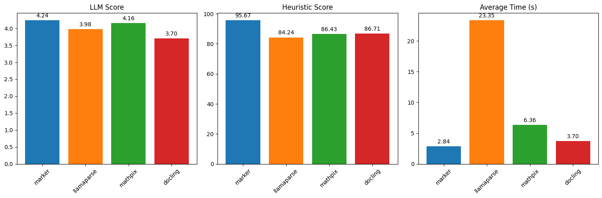
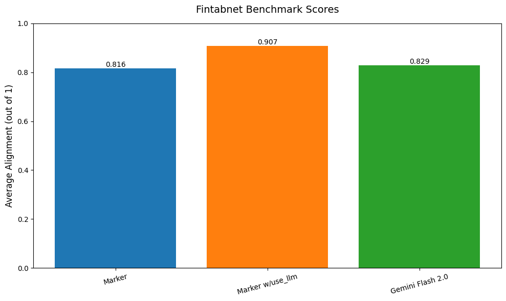
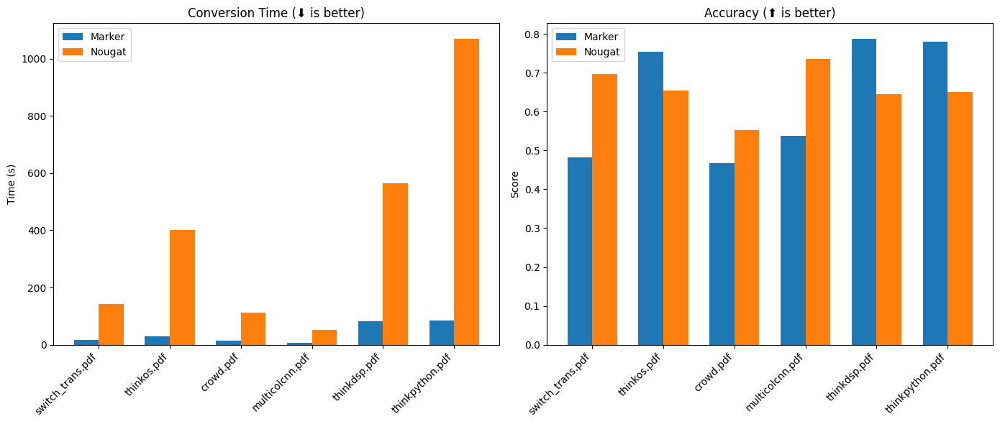

# Marker

Marker converts documents to markdown, JSON, and HTML quickly and accurately.

- Converts PDF, image, PPTX, DOCX, XLSX, HTML, EPUB files in all languages
- Formats tables, forms, equations, inline math, links, references, and code blocks
- Extracts and saves images
- Removes headers/footers/other artifacts
- Extensible with your own formatting and logic
- Optionally boost accuracy with LLMs
- Works on GPU, CPU, or MPS

## Performance



Marker benchmarks favorably compared to cloud services like Llamaparse and Mathpix, as well as other open source tools.

The above results are running single PDF pages serially.  Marker is significantly faster when running in batch mode, with a projected throughput of 122 pages/second on an H100 (.18 seconds per page across 22 processes).

See [below](#benchmarks) for detailed speed and accuracy benchmarks, and instructions on how to run your own benchmarks.

## Hybrid Mode

For the highest accuracy, pass the `--use_llm` flag to use an LLM alongside marker.  This will do things like merge tables across pages, handle inline math, format tables properly, and extract values from forms.  It can use any gemini or ollama model.  By default, it uses `gemini-2.0-flash`.  See [below](#llm-services) for details.

Here is a table benchmark comparing marker, gemini flash alone, and marker with use_llm:



As you can see, the use_llm mode offers higher accuracy than marker or gemini alone.

## Examples

| PDF | File type | Markdown                                                                                                                     | JSON                                                                                                   |
|-----|-----------|------------------------------------------------------------------------------------------------------------------------------|--------------------------------------------------------------------------------------------------------|
| [Think Python](https://greenteapress.com/thinkpython/thinkpython.pdf) | Textbook | [View](https://github.com/VikParuchuri/marker/blob/master/data/examples/markdown/thinkpython/thinkpython.md)                 | [View](https://github.com/VikParuchuri/marker/blob/master/data/examples/json/thinkpython.json)         |
| [Switch Transformers](https://arxiv.org/pdf/2101.03961.pdf) | arXiv paper | [View](https://github.com/VikParuchuri/marker/blob/master/data/examples/markdown/switch_transformers/switch_trans.md) | [View](https://github.com/VikParuchuri/marker/blob/master/data/examples/json/switch_trans.json) |
| [Multi-column CNN](https://arxiv.org/pdf/1804.07821.pdf) | arXiv paper | [View](https://github.com/VikParuchuri/marker/blob/master/data/examples/markdown/multicolcnn/multicolcnn.md)                 | [View](https://github.com/VikParuchuri/marker/blob/master/data/examples/json/multicolcnn.json)         |

# Commercial usage

I want marker to be as widely accessible as possible, while still funding my development/training costs.  Research and personal usage is always okay, but there are some restrictions on commercial usage.

The weights for the models are licensed `cc-by-nc-sa-4.0`, but I will waive that for any organization under \$5M USD in gross revenue in the most recent 12-month period AND under $5M in lifetime VC/angel funding raised. You also must not be competitive with the [Datalab API](https://www.datalab.to/).  If you want to remove the GPL license requirements (dual-license) and/or use the weights commercially over the revenue limit, check out the options [here](https://www.datalab.to).

# Hosted API

There's a hosted API for marker available [here](https://www.datalab.to/):

- Supports PDFs, word documents, and powerpoints 
- 1/4th the price of leading cloud-based competitors
- High uptime (99.99%), quality, and speed (around 15 seconds to convert a 250 page PDF)

# Community

[Discord](https://discord.gg//KuZwXNGnfH) is where we discuss future development.

# Installation

You'll need python 3.10+ and PyTorch.  You may need to install the CPU version of torch first if you're not using a Mac or a GPU machine.  See [here](https://pytorch.org/get-started/locally/) for more details.

Install with:

```shell
pip install marker-pdf
```

If you want to use marker on documents other than PDFs, you will need to install additional dependencies with:

```shell
pip install marker-pdf[full]
```

# Usage

First, some configuration:

- Your torch device will be automatically detected, but you can override this.  For example, `TORCH_DEVICE=cuda`.
- Some PDFs, even digital ones, have bad text in them.  Set the `force_ocr` flag to ensure your PDF runs through OCR, or the `strip_existing_ocr` to keep all digital text, and strip out any existing OCR text.

## Interactive App

I've included a streamlit app that lets you interactively try marker with some basic options.  Run it with:

```shell
pip install streamlit
marker_gui
```

## Convert a single file

```shell
marker_single /path/to/file.pdf
```

You can pass in PDFs or images.

Options:
- `--output_dir PATH`: Directory where output files will be saved. Defaults to the value specified in settings.OUTPUT_DIR.
- `--output_format [markdown|json|html]`: Specify the format for the output results.
- `--paginate_output`: Paginates the output, using `\n\n{PAGE_NUMBER}` followed by `-` * 48, then `\n\n` 
- `--use_llm`: Uses an LLM to improve accuracy.  You must set your Gemini API key using the `GOOGLE_API_KEY` env var.
- `--redo_inline_math`: If you want the highest quality inline math conversion, use this along with `--use_llm`.
- `--disable_image_extraction`: Don't extract images from the PDF.  If you also specify `--use_llm`, then images will be replaced with a description.
- `--page_range TEXT`: Specify which pages to process. Accepts comma-separated page numbers and ranges. Example: `--page_range "0,5-10,20"` will process pages 0, 5 through 10, and page 20.
- `--force_ocr`: Force OCR processing on the entire document, even for pages that might contain extractable text.
- `--strip_existing_ocr`: Remove all existing OCR text in the document and re-OCR with surya.
- `--debug`: Enable debug mode for additional logging and diagnostic information.
- `--processors TEXT`: Override the default processors by providing their full module paths, separated by commas. Example: `--processors "module1.processor1,module2.processor2"`
- `--config_json PATH`: Path to a JSON configuration file containing additional settings.
- `--languages TEXT`: Optionally specify which languages to use for OCR processing. Accepts a comma-separated list. Example: `--languages "en,fr,de"` for English, French, and German.
- `config --help`: List all available builders, processors, and converters, and their associated configuration.  These values can be used to build a JSON configuration file for additional tweaking of marker defaults.
- `--converter_cls`: One of `marker.converters.pdf.PdfConverter` (default) or `marker.converters.table.TableConverter`.  The `PdfConverter` will convert the whole PDF, the `TableConverter` will only extract and convert tables.
- `--llm_service`: Which llm service to use if `--use_llm` is passed.  This defaults to `marker.services.gemini.GoogleGeminiService`.
- `--help`: see all of the flags that can be passed into marker.  (it supports many more options then are listed above)

The list of supported languages for surya OCR is [here](https://github.com/VikParuchuri/surya/blob/master/surya/recognition/languages.py).  If you don't need OCR, marker can work with any language.

## Convert multiple files

```shell
marker /path/to/input/folder --workers 4
```

- `marker` supports all the same options from `marker_single` above.
- `--workers` is the number of conversion workers to run simultaneously.  This is set to 5 by default, but you can increase it to increase throughput, at the cost of more CPU/GPU usage.  Marker will use 5GB of VRAM per worker at the peak, and 3.5GB average.

## Convert multiple files on multiple GPUs

```shell
NUM_DEVICES=4 NUM_WORKERS=15 marker_chunk_convert ../pdf_in ../md_out
```

- `NUM_DEVICES` is the number of GPUs to use.  Should be `2` or greater.
- `NUM_WORKERS` is the number of parallel processes to run on each GPU.

## Use from python

See the `PdfConverter` class at `marker/converters/pdf.py` function for additional arguments that can be passed.

```python
from marker.converters.pdf import PdfConverter
from marker.models import create_model_dict
from marker.output import text_from_rendered

converter = PdfConverter(
    artifact_dict=create_model_dict(),
)
rendered = converter("FILEPATH")
text, _, images = text_from_rendered(rendered)
```

`rendered` will be a pydantic basemodel with different properties depending on the output type requested.  With markdown output (default), you'll have the properties `markdown`, `metadata`, and `images`.  For json output, you'll have `children`, `block_type`, and `metadata`.

### Custom configuration

You can pass configuration using the `ConfigParser`.  To see all available options, do `marker_single --help`.

```python
from marker.converters.pdf import PdfConverter
from marker.models import create_model_dict
from marker.config.parser import ConfigParser

config = {
    "output_format": "json",
    "ADDITIONAL_KEY": "VALUE"
}
config_parser = ConfigParser(config)

converter = PdfConverter(
    config=config_parser.generate_config_dict(),
    artifact_dict=create_model_dict(),
    processor_list=config_parser.get_processors(),
    renderer=config_parser.get_renderer(),
    llm_service=config_parser.get_llm_service()
)
rendered = converter("FILEPATH")
```

### Extract blocks

Each document consists of one or more pages.  Pages contain blocks, which can themselves contain other blocks.  It's possible to programmatically manipulate these blocks.  

Here's an example of extracting all forms from a document:

```python
from marker.converters.pdf import PdfConverter
from marker.models import create_model_dict
from marker.schema import BlockTypes

converter = PdfConverter(
    artifact_dict=create_model_dict(),
)
document = converter.build_document("FILEPATH")
forms = document.contained_blocks((BlockTypes.Form,))
```

Look at the processors for more examples of extracting and manipulating blocks.

## Other converters

You can also use other converters that define different conversion pipelines:

### Extract tables

The `TableConverter` will only convert and extract tables:

```python
from marker.converters.table import TableConverter
from marker.models import create_model_dict
from marker.output import text_from_rendered

converter = TableConverter(
    artifact_dict=create_model_dict(),
)
rendered = converter("FILEPATH")
text, _, images = text_from_rendered(rendered)
```

This takes all the same configuration as the PdfConverter.  You can specify the configuration `force_layout_block=Table` to avoid layout detection and instead assume every page is a table.  Set `output_format=json` to also get cell bounding boxes.

You can also run this via the CLI with 
```shell
marker_single FILENAME --use_llm --force_layout_block Table --converter_cls marker.converters.table.TableConverter --output_format json
```

# Output Formats

## Markdown

Markdown output will include:

- image links (images will be saved in the same folder)
- formatted tables
- embedded LaTeX equations (fenced with `$$`)
- Code is fenced with triple backticks
- Superscripts for footnotes

## HTML

HTML output is similar to markdown output:

- Images are included via `img` tags
- equations are fenced with `<math>` tags
- code is in `pre` tags

## JSON

JSON output will be organized in a tree-like structure, with the leaf nodes being blocks.  Examples of leaf nodes are a single list item, a paragraph of text, or an image.

The output will be a list, with each list item representing a page.  Each page is considered a block in the internal marker schema.  There are different types of blocks to represent different elements.  

Pages have the keys:

- `id` - unique id for the block.
- `block_type` - the type of block. The possible block types can be seen in `marker/schema/__init__.py`.  As of this writing, they are ["Line", "Span", "FigureGroup", "TableGroup", "ListGroup", "PictureGroup", "Page", "Caption", "Code", "Figure", "Footnote", "Form", "Equation", "Handwriting", "TextInlineMath", "ListItem", "PageFooter", "PageHeader", "Picture", "SectionHeader", "Table", "Text", "TableOfContents", "Document"]
- `html` - the HTML for the page.  Note that this will have recursive references to children.  The `content-ref` tags must be replaced with the child content if you want the full html.  You can see an example of this at `marker/output.py:json_to_html`.  That function will take in a single block from the json output, and turn it into HTML.
- `polygon` - the 4-corner polygon of the page, in (x1,y1), (x2,y2), (x3, y3), (x4, y4) format.  (x1,y1) is the top left, and coordinates go clockwise.
- `children` - the child blocks.

The child blocks have two additional keys:

- `section_hierarchy` - indicates the sections that the block is part of.  `1` indicates an h1 tag, `2` an h2, and so on.
- `images` - base64 encoded images.  The key will be the block id, and the data will be the encoded image.

Note that child blocks of pages can have their own children as well (a tree structure).

```json
{
      "id": "/page/10/Page/366",
      "block_type": "Page",
      "html": "<content-ref src='/page/10/SectionHeader/0'></content-ref><content-ref src='/page/10/SectionHeader/1'></content-ref><content-ref src='/page/10/Text/2'></content-ref><content-ref src='/page/10/Text/3'></content-ref><content-ref src='/page/10/Figure/4'></content-ref><content-ref src='/page/10/SectionHeader/5'></content-ref><content-ref src='/page/10/SectionHeader/6'></content-ref><content-ref src='/page/10/TextInlineMath/7'></content-ref><content-ref src='/page/10/TextInlineMath/8'></content-ref><content-ref src='/page/10/Table/9'></content-ref><content-ref src='/page/10/SectionHeader/10'></content-ref><content-ref src='/page/10/Text/11'></content-ref>",
      "polygon": [[0.0, 0.0], [612.0, 0.0], [612.0, 792.0], [0.0, 792.0]],
      "children": [
        {
          "id": "/page/10/SectionHeader/0",
          "block_type": "SectionHeader",
          "html": "<h1>Supplementary Material for <i>Subspace Adversarial Training</i> </h1>",
          "polygon": [
            [217.845703125, 80.630859375], [374.73046875, 80.630859375],
            [374.73046875, 107.0],
            [217.845703125, 107.0]
          ],
          "children": null,
          "section_hierarchy": {
            "1": "/page/10/SectionHeader/1"
          },
          "images": {}
        },
        ...
        ]
    }


```

## Metadata

All output formats will return a metadata dictionary, with the following fields:

```json
{
    "table_of_contents": [
      {
        "title": "Introduction",
        "heading_level": 1,
        "page_id": 0,
        "polygon": [...]
      }
    ], // computed PDF table of contents
    "page_stats": [
      {
        "page_id":  0, 
        "text_extraction_method": "pdftext",
        "block_counts": [("Span", 200), ...]
      },
      ...
    ]
}
```

# LLM Services

When running with the `--use_llm` flag, you have a choice of services you can use:

- `Gemini` - this will use the Gemini developer API by default.  You'll need to pass `--gemini_api_key` to configuration.
- `Google Vertex` - this will use vertex, which can be more reliable.  You'll need to pass `--vertex_project_id`.  To use it, set `--llm_service=marker.services.vertex.GoogleVertexService`.
- `Ollama` - this will use local models.  You can configure `--ollama_base_url` and `--ollama_model`. To use it, set `--llm_service=marker.services.ollama.OllamaService`.
- `Claude` - this will use the anthropic API.  You can configure `--claude_api_key`, and `--claude_model_name`.  To use it, set `--llm_service=marker.services.claude.ClaudeService`.

These services may have additional optional configuration as well - you can see it by viewing the classes.

# Internals

Marker is easy to extend.  The core units of marker are:

- `Providers`, at `marker/providers`.  These provide information from a source file, like a PDF.
- `Builders`, at `marker/builders`.  These generate the initial document blocks and fill in text, using info from the providers.
- `Processors`, at `marker/processors`.  These process specific blocks, for example the table formatter is a processor.
- `Renderers`, at `marker/renderers`. These use the blocks to render output.
- `Schema`, at `marker/schema`.  The classes for all the block types.
- `Converters`, at `marker/converters`.  They run the whole end to end pipeline.

To customize processing behavior, override the `processors`.  To add new output formats, write a new `renderer`.  For additional input formats, write a new `provider.`

Processors and renderers can be directly passed into the base `PDFConverter`, so you can specify your own custom processing easily.

## API server

There is a very simple API server you can run like this:

```shell
pip install -U uvicorn fastapi python-multipart
marker_server --port 8001
```

This will start a fastapi server that you can access at `localhost:8001`.  You can go to `localhost:8001/docs` to see the endpoint options.

You can send requests like this:

```
import requests
import json

post_data = {
    'filepath': 'FILEPATH',
    # Add other params here
}

requests.post("http://localhost:8001/marker", data=json.dumps(post_data)).json()
```

Note that this is not a very robust API, and is only intended for small-scale use.  If you want to use this server, but want a more robust conversion option, you can use the hosted [Datalab API](https://www.datalab.to/plans).

# Troubleshooting

There are some settings that you may find useful if things aren't working the way you expect:

- If you have issues with accuracy, try setting `--use_llm` to use an LLM to improve quality.  You must set `GOOGLE_API_KEY` to a Gemini API key for this to work.
- Make sure to set `force_ocr` if you see garbled text - this will re-OCR the document.
- `TORCH_DEVICE` - set this to force marker to use a given torch device for inference.
- If you're getting out of memory errors, decrease worker count.  You can also try splitting up long PDFs into multiple files.

## Debugging

Pass the `debug` option to activate debug mode.  This will save images of each page with detected layout and text, as well as output a json file with additional bounding box information.

# Benchmarks

## Overall PDF Conversion

We created a [benchmark set](https://huggingface.co/datasets/datalab-to/marker_benchmark) by extracting single PDF pages from common crawl.  We scored based on a heuristic that aligns text with ground truth text segments, and an LLM as a judge scoring method.

| Method     | Avg Time | Heuristic Score | LLM Score |
|------------|----------|-----------------|-----------|
| marker     | 2.83837  | 95.6709         | 4.23916   |
| llamaparse | 23.348   | 84.2442         | 3.97619   |
| mathpix    | 6.36223  | 86.4281         | 4.15626   |
| docling    | 3.69949  | 86.7073         | 3.70429   |

Benchmarks were run on an H100 for markjer and docling - llamaparse and mathpix used their cloud services.  We can also look at it by document type:



| Document Type        | Marker heuristic | Marker LLM | Llamaparse Heuristic | Llamaparse LLM | Mathpix Heuristic | Mathpix LLM | Docling Heuristic | Docling LLM |
|----------------------|------------------|------------|----------------------|----------------|-------------------|-------------|-------------------|-------------|
| Scientific paper     | 96.6737          | 4.34899    | 87.1651              | 3.96421        | 91.2267           | 4.46861     | 92.135            | 3.72422     |
| Book page            | 97.1846          | 4.16168    | 90.9532              | 4.07186        | 93.8886           | 4.35329     | 90.0556           | 3.64671     |
| Other                | 95.1632          | 4.25076    | 81.1385              | 4.01835        | 79.6231           | 4.00306     | 83.8223           | 3.76147     |
| Form                 | 88.0147          | 3.84663    | 66.3081              | 3.68712        | 64.7512           | 3.33129     | 68.3857           | 3.40491     |
| Presentation         | 95.1562          | 4.13669    | 81.2261              | 4              | 83.6737           | 3.95683     | 84.8405           | 3.86331     |
| Financial document   | 95.3697          | 4.39106    | 82.5812              | 4.16111        | 81.3115           | 4.05556     | 86.3882           | 3.8         |
| Letter               | 98.4021          | 4.5        | 93.4477              | 4.28125        | 96.0383           | 4.45312     | 92.0952           | 4.09375     |
| Engineering document | 93.9244          | 4.04412    | 77.4854              | 3.72059        | 80.3319           | 3.88235     | 79.6807           | 3.42647     |
| Legal document       | 96.689           | 4.27759    | 86.9769              | 3.87584        | 91.601            | 4.20805     | 87.8383           | 3.65552     |
| Newspaper page       | 98.8733          | 4.25806    | 84.7492              | 3.90323        | 96.9963           | 4.45161     | 92.6496           | 3.51613     |
| Magazine page        | 98.2145          | 4.38776    | 87.2902              | 3.97959        | 93.5934           | 4.16327     | 93.0892           | 4.02041     |

## Throughput

We benchmarked throughput using a [single long PDF](https://www.greenteapress.com/thinkpython/thinkpython.pdf).

| Method  | Time per page | Time per document | VRAM used |
|---------|---------------|-------------------|---------- |
| marker  | 0.18          | 43.42             |  3.17GB   |

The projected throughput is 122 pages per second on an H100 - we can run 22 individual processes given the VRAM used.

## Table Conversion

Marker can extract tables from PDFs using `marker.converters.table.TableConverter`. The table extraction performance is measured by comparing the extracted HTML representation of tables against the original HTML representations using the test split of [FinTabNet](https://developer.ibm.com/exchanges/data/all/fintabnet/). The HTML representations are compared using a tree edit distance based metric to judge both structure and content. Marker detects and identifies the structure of all tables in a PDF page and achieves these scores:

| Method           | Avg score | Total tables |
|------------------|-----------|--------------|
| marker           | 0.816     | 99           |
| marker w/use_llm | 0.907     | 99           |
| gemini           | 0.829     | 99           |

The `--use_llm` flag can significantly improve table recognition performance, as you can see.

We filter out tables that we cannot align with the ground truth, since fintabnet and our layout model have slightly different detection methods (this results in some tables being split/merged).

## Running your own benchmarks

You can benchmark the performance of marker on your machine. Install marker manually with:

```shell
git clone https://github.com/VikParuchuri/marker.git
poetry install
```

### Overall PDF Conversion

Download the benchmark data [here](https://drive.google.com/file/d/1ZSeWDo2g1y0BRLT7KnbmytV2bjWARWba/view?usp=sharing) and unzip. Then run the overall benchmark like this:

```shell
python benchmarks/overall.py --methods marker --scores heuristic,llm
```

Options:

- `--use_llm` use an llm to improve the marker results.
- `--max_rows` how many rows to process for the benchmark.
- `--methods` can be `llamaparse`, `mathpix`, `docling`, `marker`.  Comma separated.
- `--scores` which scoring functions to use, can be `llm`, `heuristic`.  Comma separated.

### Table Conversion
The processed FinTabNet dataset is hosted [here](https://huggingface.co/datasets/datalab-to/fintabnet-test) and is automatically downloaded. Run the benchmark with:

```shell
python benchmarks/table/table.py --max_rows 100
```

Options:

- `--use_llm` uses an llm with marker to improve accuracy.
- `--use_gemini` also benchmarks gemini 2.0 flash.

# How it works

Marker is a pipeline of deep learning models:

- Extract text, OCR if necessary (heuristics, [surya](https://github.com/VikParuchuri/surya))
- Detect page layout and find reading order ([surya](https://github.com/VikParuchuri/surya))
- Clean and format each block (heuristics, [texify](https://github.com/VikParuchuri/texify), [surya](https://github.com/VikParuchuri/surya))
- Optionally use an LLM to improve quality
- Combine blocks and postprocess complete text

It only uses models where necessary, which improves speed and accuracy.

# Limitations

PDF is a tricky format, so marker will not always work perfectly.  Here are some known limitations that are on the roadmap to address:

- Very complex layouts, with nested tables and forms, may not work
- Forms may not be rendered well

Note: Passing the `--use_llm` flag will mostly solve these issues.

# Thanks

This work would not have been possible without amazing open source models and datasets, including (but not limited to):

- Surya
- Texify
- Pypdfium2/pdfium
- DocLayNet from IBM

Thank you to the authors of these models and datasets for making them available to the community!